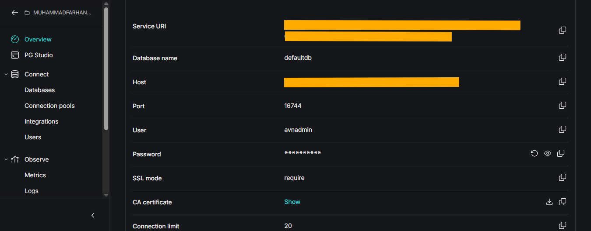
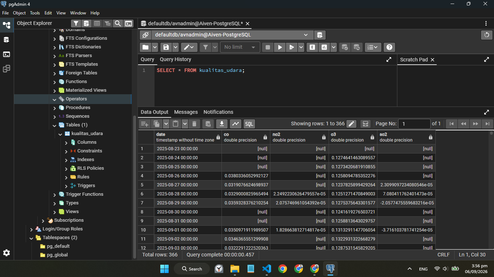
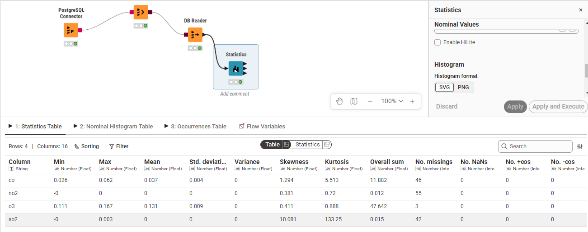

# Air Quality Data Integration in Sialkot using Aiven PostgreSQL, pgAdmin, and KNIME

This document outlines the steps taken to integrate, manage, and statistically analyze air quality data for Sialkot, Pakistan, using cloud database infrastructure and visual analytics.

## 1. Creating a PostgreSQL Service in Aiven

The first step is to provision a cloud-based relational database server that can be accessed remotely.

1. Open the Aiven Console and log in.
2. Click **Create service** and select **PostgreSQL**.
3. Choose a cloud provider and the region closest to your location.
4. Select the appropriate service plan (e.g., Free tier or Startup).
5. Name the service and wait for the status to change to **Running**.

## 2. Retrieving Aiven Credentials

To connect the database to a local management tool (pgAdmin) and KNIME, you need the connection credentials.

From the Aiven Overview page, collect the following:

* **Host** (e.g., `pg-b33aa03-...aivencloud.com`)
* **Port** (e.g., `16744`)
* **Database Name** (`defaultdb`)
* **User** (`avnadmin`)
* **Password**
* **SSL Mode** (`require`)

Here is the Aiven service after the credentials were retrieved:



## 3. Connecting Aiven PostgreSQL to pgAdmin

Connect your local database management tool to the cloud server.

1. Open **pgAdmin**.
2. Right-click on **Servers** > **Register** > **Server...**
3. In the **General** tab, name the server (e.g., *Aiven Postgres*).
4. In the **Connection** tab, input the Host, Port, Maintenance database, Username, and Password retrieved from Aiven. Save to establish the connection.

## 4. Importing the Air Quality CSV into PostgreSQL

1. Open the Query Tool in pgAdmin for `defaultdb` and create the target table:

   ```sql
   CREATE TABLE kualitas_udara (
       date TIMESTAMP,
       co DOUBLE PRECISION,
       no2 DOUBLE PRECISION,
       o3 DOUBLE PRECISION,
       so2 DOUBLE PRECISION
   );
   ```

2. Navigate to **Schemas > public > Tables**, right-click `kualitas_udara`, and select **Import/Export Data...**
3. Set to **Import**, select `AirQualitySialkot.csv`, set the format to `csv`, and configure the delimiter as a comma. Leave the "Null strings" field empty to properly handle missing values.

Here is the data successfully imported into pgAdmin:



## 5. Data Integration Using KNIME

To perform the statistical analysis without relying entirely on local code, the cloud database is integrated into KNIME Analytics Platform.

* **PostgreSQL Connector**: Configured with the Aiven Host, Port, Database name, credentials, and the JDBC parameter `sslmode=require`.
* **DB Table Selector**: Points to the `kualitas_udara` table in the `public` schema.
* **DB Reader**: Executes the query to load the cloud data into KNIME's local memory.
* **Statistics**: Computes the statistical moments across the numeric columns (`co`, `no2`, `o3`, `so2`).

Below is the KNIME workflow used, together with the resulting Statistics Table:



**Note on Median:** the Statistics node's "Calculate median values (computationally expensive)" option was later enabled and the node re-executed specifically to obtain the median values used in Section 6.14.

## 6. Explanations, Formulas, and Calculations of Statistical Features

The values below are taken directly from the KNIME Statistics node output for the four pollutant columns (`co`, `no2`, `o3`, `so2`), so they reflect exactly what the node computed — not manually recalculated approximations.

### 1. Column
The name of the feature or pollutant being analyzed. In this dataset: `co`, `no2`, `o3`, `so2`.

### 2. Min
The minimum (smallest) value recorded for that column.

| Column | Min |
|--------|-----|
| co  | 0.0263840689069845 |
| no2 | -0.0000013587672827536771 |
| o3  | 0.111035822580258 |
| so2 | -0.00034251369138170657 |

### 3. Max
The maximum (largest) value recorded for that column.

| Column | Max |
|--------|-----|
| co  | 0.0621928385458886 |
| no2 | 0.00008256092669831734 |
| o3  | 0.1670629566624051 |
| so2 | 0.0033831760520115 |

### 4. Mean
The mathematical average of all valid data points, calculated by summing all values and dividing by the total number of valid entries ($n$).

**Formula:**

$$\overline{x}=\frac{1}{n}\sum_{i=1}^{n}x_{i}$$

**Results (from the KNIME node):**

| Column | Mean |
|--------|------|
| co  | 0.03713175413800379 |
| no2 | 0.00003746621538938806 |
| o3  | 0.13124628255599177 |
| so2 | 0.00004642290373327145 |

### 5. Standard Deviation
Measures how far the data spreads out from the mean. A small value means the data points are clustered closely around the mean; a large value indicates high variability.

**Formula (Sample):**

$$s=\sqrt{\frac{\sum_{i=1}^{n}(x_{i}-\overline{x})^{2}}{n-1}}$$

**Results:**

| Column | Std. Deviation |
|--------|-----------------|
| co  | 0.004498755891468117 |
| no2 | 0.000012044147306422724 |
| o3  | 0.009132103703760884 |
| so2 | 0.00023509693522402115 |

### 6. Variance
The square of the standard deviation ($s^2$). It measures total dispersion.

**Formula:**

$$s^{2}=\frac{\sum_{i=1}^{n}(x_{i}-\overline{x})^{2}}{n-1}$$

**Results:**

| Column | Variance | Displayed in KNIME table |
|--------|----------|----------------------------|
| co  | 2.0238804571019094 × 10⁻⁵ | 0 |
| no2 | 1.4506148433880978 × 10⁻¹⁰ | 0 |
| o3  | 8.339531805624325 × 10⁻⁵ | 0 |
| so2 | 5.52705689517276 × 10⁻⁸ | 0 |

Because all four pollutants have extremely small standard deviations, squaring them produces values so close to zero that the Statistics Table (rounded display) shows them all as `0`, even though the underlying figures above are non-zero.

### 7. Skewness
Measures the asymmetry of the data distribution around the mean.

* Positive (> 0): Right-skewed (tail points to higher values).
* Negative (< 0): Left-skewed.

**Results:**

| Column | Skewness |
|--------|----------|
| co  | 1.293980174522114 |
| no2 | 0.3808335085627898 |
| o3  | 0.4109885279008478 |
| so2 | 10.08118738384211 |

All four pollutants show positive skewness, meaning most readings sit at lower concentrations with occasional high spikes. `so2` is by far the most skewed (10.08), indicating rare but very extreme spikes relative to its typical value.

### 8. Kurtosis
Describes the "peakedness" of the distribution. High positive kurtosis (leptokurtic) means the data has heavy tails and a sharp peak, indicating the presence of extreme outliers.

**Results:**

| Column | Kurtosis |
|--------|----------|
| co  | 5.512806891517834 |
| no2 | 0.7200797034388589 |
| o3  | 0.888332953414811 |
| so2 | 133.24954827532588 |

`so2`'s kurtosis (133.25) is extremely high compared to the other pollutants, confirming that its distribution is dominated by a small number of severe outlier readings rather than a smooth spread of values.

### 9. Overall Sum
The total cumulative sum of all valid observations within the column.

**Formula:**

$$\text{Overall Sum}=\sum_{i=1}^{n}x_{i}$$

**Results:**

| Column | Overall Sum |
|--------|--------------|
| co  | 11.882161324161213 |
| no2 | 0.011651992986099686 |
| o3  | 47.642400567825014 |
| so2 | 0.01504102080957995 |

### 10. No. Missing
The number of empty or null rows in the dataset, often due to satellite cloud cover or lack of orbital pass.

**Formula:**

$$\text{Missing Values}=N_{total}-n$$

(where $N_{total}$ is the 366 days in the year, and $n$ is the valid count)

**Results:**

| Column | No. Missing | Valid count ($n = 366 - \text{Missing}$) |
|--------|-------------|--------------------------------------------|
| co  | 46 | 320 |
| no2 | 55 | 311 |
| o3  | 3  | 363 |
| so2 | 42 | 324 |

### 11. No. NaNs
The number of "Not a Number" errors (e.g., from illegal math operations like $0/0$).

**Formula:**

$$\text{No. NaNs}=\sum_{i=1}^{N_{total}}\mathbb{I}(x_i \text{ is NaN})$$

**Results:** the KNIME output reports **0 NaNs for all four columns** (`co`, `no2`, `o3`, `so2`). Empty readings in this dataset are recorded as missing values (Section 10), not as NaN computation errors — so this count stays at 0 across the board.

### 12 & 13. No. +∞s / No. -∞s
The number of values representing positive or negative infinity, typically produced by dividing a non-zero number by zero.

**Formula:**

$$\text{No. }+\infty\text{s}=\sum_{i=1}^{N_{total}}\mathbb{I}(x_i=+\infty), \qquad \text{No. }-\infty\text{s}=\sum_{i=1}^{N_{total}}\mathbb{I}(x_i=-\infty)$$

**Results:** since the satellite data is strictly numerical concentration readings (no division-by-zero style computations occur upstream), the KNIME output reports **0 positive infinities and 0 negative infinities for all four columns** (`co`, `no2`, `o3`, `so2`).

### 14. Median
The exact middle value when the valid data points are sorted from smallest to largest. If $n$ is even, it is the average of the two middle numbers.

**Formula:**

$$Median=\begin{cases}x_{(\frac{n+1}{2})} & \text{if } n \text{ is odd}\\ \frac{1}{2}\left(x_{(\frac{n}{2})}+x_{(\frac{n}{2}+1)}\right) & \text{if } n \text{ is even}\end{cases}$$

**Results:** after re-running the Statistics node with "Calculate median values" enabled, KNIME reports:

| Column | Median |
|--------|--------|
| co  | 0.037 |
| no2 | 0 |
| o3  | 0.131 |
| so2 | 0 |

Note that `no2` and `so2` show a median of `0` in the rounded table display — the same effect seen with their standard deviation and variance (Section 5–6): both pollutants have concentrations so close to zero (on the order of 10⁻⁵) that KNIME's default display rounds the middle value down to `0`.

### 15. Row Count
The absolute total number of rows in the table, encompassing both valid data and missing values.

**Formula:**

$$\text{Row Count}=n+\text{Missing Values}$$

**Results:**

| Column | Valid ($n$) | Missing | Row Count |
|--------|-------------|---------|-----------|
| co  | 320 | 46 | 366 |
| no2 | 311 | 55 | 366 |
| o3  | 363 | 3  | 366 |
| so2 | 324 | 42 | 366 |

Row Count is **366** for all columns, corresponding to one row per day of the year.
